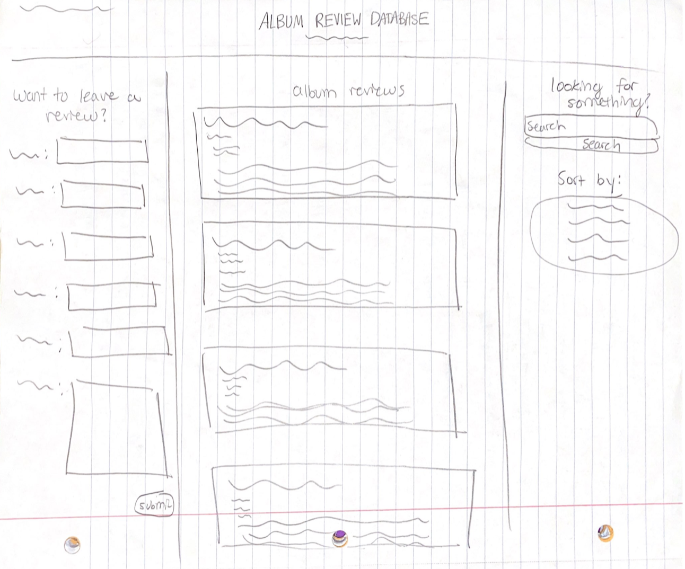
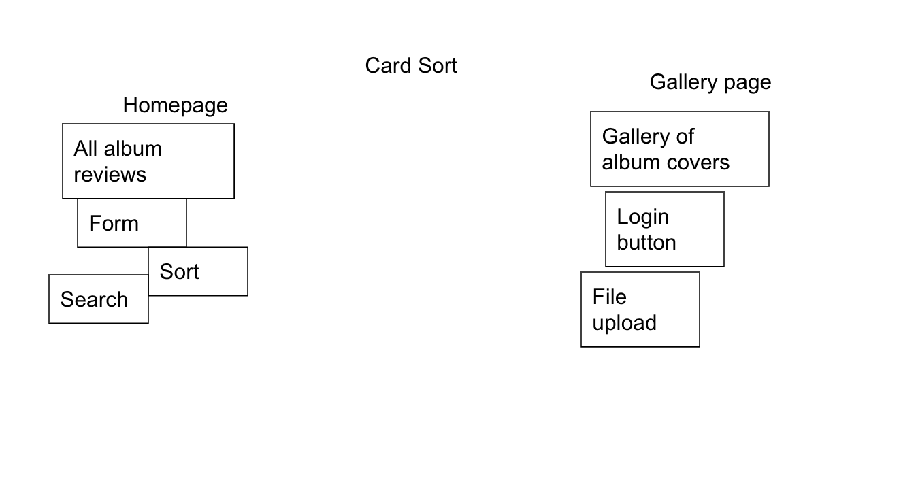
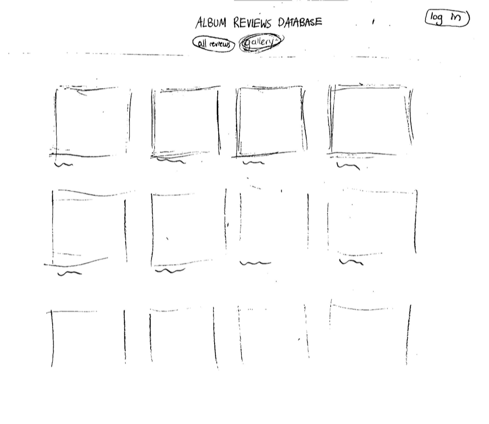
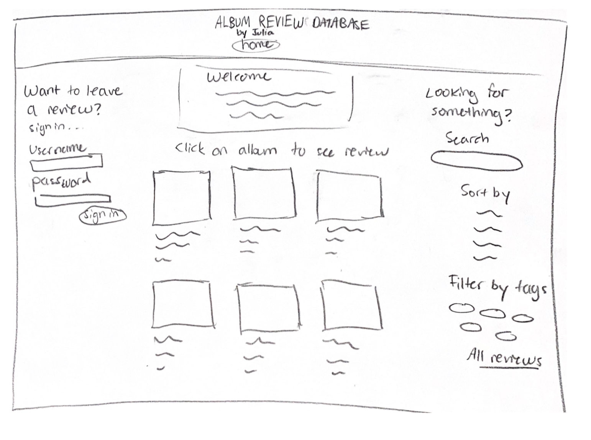
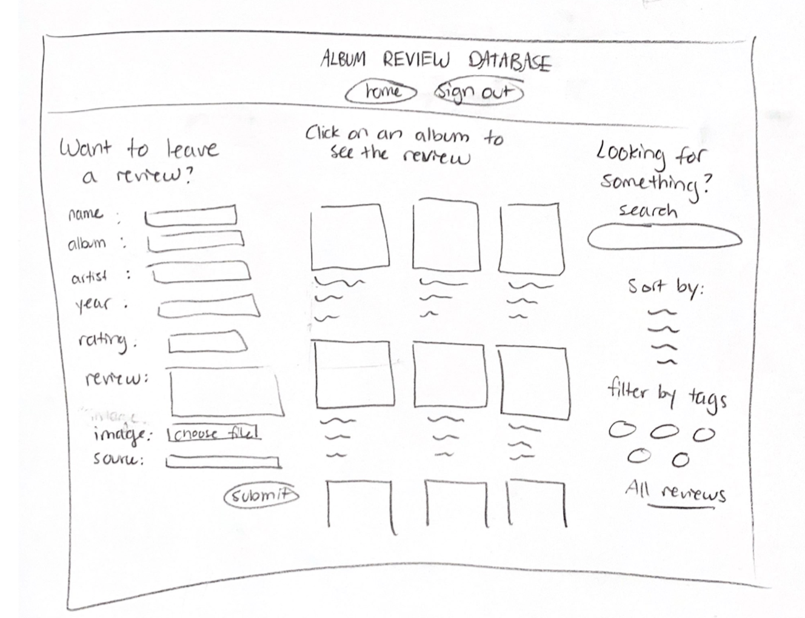
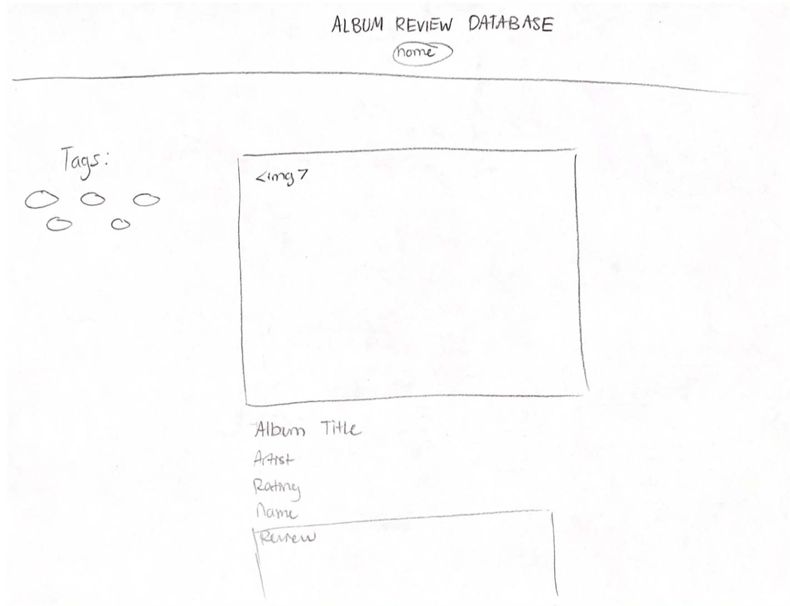
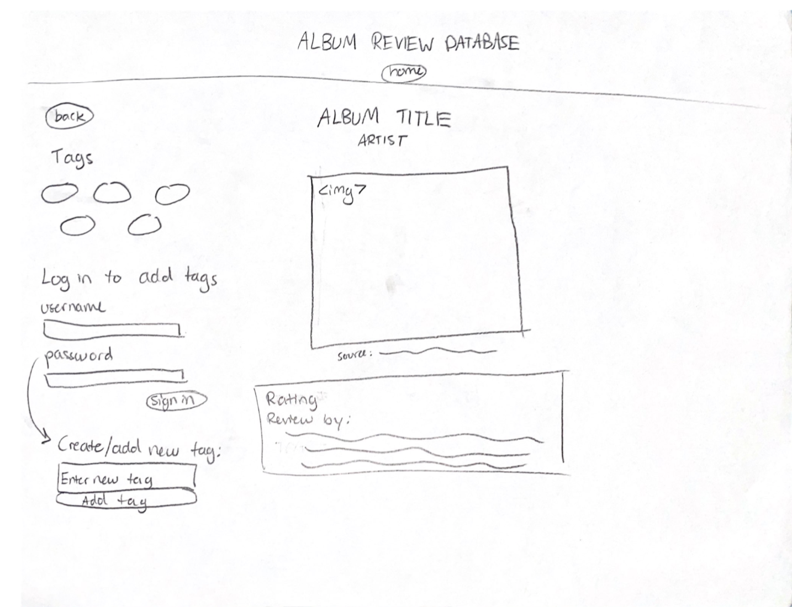

# Project 3: Design Journey

Be clear and concise in your writing. Bullets points are encouraged.

**Everything, including images, must be visible in Markdown Preview.** If it's not visible in Markdown Preview, then we won't grade it. We won't give you partial credit either. This is your warning.


## Design Plan

### Project 1 or 2
> Do you plan to reuse your Project 1 or 2 site?
> Which project?

> Yes, Project 2

> If yes, please include sketches of the site's current design (you may copy the "final" sections from those assignments.)




### Describe your Media Catalog (Milestone 1)
> What will your collection be about?
> What type of media will your site display? (images, videos, audio)

> My collection will be an album reviews collection, and my site will display images (album art).


### Audiences (Milestone 1)
> Briefly explain your site's audiences. Be specific and justify why each audience is appropriate for your site.
> You are required to have **two** audiences: "information consumers" and "site administrators"

Information Consumer: The information consumer of this site is a music lover who wants to learn more about people's opinions on albums to help them decide what music to listen to.


Site Administrator: Site Administrators are music experts and avid listeners looking to keep the collection updated with as many opinions as possible for the sake of the information consumers.


### Personas (Milestone 1)
> Your personas must have a name and a "depiction". This can be a photo of a face or a drawing, etc.
> There is no required format for the persona.
> You may type out the persona below with bullet points or include an image of the persona. Just make sure it's easy to read the persona when previewing markdown.
> Your personas should focus on the goals, obstacles, and factors that influence behavior of each audience.

> Persona for your "consumer" audience:


> Sofi

> Factors that influence behavior:
- Sofi spends a lot of time doing research about music
- She is very organized
- Is a fan of very specific genres

> Needs/Obstacles/Decisions
- Must be able to see music organized/sorted by years
- Wants to avoid having to scroll to find specific genres
- Her decision to write a paper on an artist depends on how high their ratings are


> Persona for your "administrator" audience:


> Professor Peraino

> Factors that influence behavior:
- Is a music professor at Cornell University
- Does a lot of music related research and writing
- Cares a lot about specific decades for her research


> Needs/Obstacles/Decisions
- She needs to be able to write reviews
- She must be able to delete user's reviews
- Must be able to click on an item and see an expanded version for her research
- Must be able to easily find where to submit albums, due to busy schedule
- Must be able to add new tag names


### Site Design (Milestone 1)
> Document your _entire_ design process. **We want to see iteration!**
> Show us the evolution of your design from your first idea (sketch) to the final design you plan to implement (sketch).
> Show us the process you used to organize content and plan the navigation, if applicable (card sorting).
> Plan your URLs for the site.
> Provide a brief explanation _underneath_ each design artifact. Explain what the artifact is, how it meets the goals of your personas (**refer to your personas by name**).
> Clearly label the final design.


> This card sort categorizes my website into 2 pages: homepage and gallery. The homepage has all of the reviews for Sofi to see without having to log in. The gallery page has a login button, so Sofi can log in and make reviews, as well as view all the reviews in a gallery format.


> This first iteration of the gallery page shows all of the album covers with their titles below. Sofi can then click on one of these to direct her to a page with more information.


> This first iteration of my homepage is what viewers, like Sofi, will see. It is the final design from project 2, but I have decided that all viewers will see this on the homepage before they log in, so that users like Sofi have easy access for seeing reviews before they log in, in case they are doing research and not adding to the database. Sofi can easily search and sort through the reviews so that she may write her articles or browse easily for fun.


> This iteration of the homepage, when the user is logged out, meets Sofi and Profesor Peraino's needs because they can easily navigate to the log in form, and can easily find the filtering and sorting buttons, which are important to their work. The design is easy to follow, as it is clearly separated with clear proximity.


> This iteration shows the logged in homepage, where Sofi and Prof. Peraino can easily see the form to add entries into the databse. It is really important that they are able to use this form, so the form was made to be usable: clear left to right patter, good use of feedback, and proximity.


> This iteration of the review page shows the album cover, along with all of the information about the review below it. Sofi will easily be able to view everything about a review and edit her own, and Prof. Peraino will easily be able to delete the review if necessary.


> This final iteration of the review page is very usable for Sofi and Profesor Peraino because the review can be seen regardless if the user is logged in, but if Sofi or Peraino are logged in, they will find the tags to be very usable, as they are clearly labeled, and the functions follow design patterns. There is a form to submit tags, and a link "x" to delete tags. This will make Sofi's viewing and Professor's management of the site very easy.

> The URL will be: /album-gallery


### Design Patterns (Milestone 1)
> Write a one paragraph reflection explaining how you used the design patterns in your site's design.

> In my design for the homepage, I used online catalog design principles by removing many of the harsh lines, while still following the principles of proximity to make sure it is obvious which albums are part of which elements. I kept the colors and typography consistent. Each element is clearly aligned in so that it is clear to Sofi where one starts and another begins. They are aligned so that the reviews are easy to follow with the eye, especially when scrolling. The data is not presented in a cluttered manner, and there is a very clear hierarchy when viewing an element. The album name is on top and is bolded and a bigger font. Therefore, Sofi will know exactly what the element is referring to. Additionally, there is a bit of breathing room in between elements so it is clear where one stops and another starts. I used image catalog design principles with the design of a user's Instagram feed as the inspiration, making the images far enough apart that Sofi would know that they are separate entries, while having them laid out in an aesthetically pleasing table manner. There are no harsh lines to distract Sofi, and there is no hierarchy among the images (which are album covers), so they are distributed with equal spacing.

> For the review page, I made it very easy for Sofi and Professor Peraino to clearly see the review and all of the relevant aspects of the review. I encapsulated the review in a clear box, so that there is proximity within the review and it is clear that it is all one element. Additionally, the review page design follows the principles of hierarchy so it is clear to Sofi and Professor Peraino what the album title and artist is, and so that it is clear what the review and ratings are refering to. There are no harsh lines, and there is a good amount of space within the review, but the text itself is all lined up so Sofi and Peraino can follow the review down the page.


## Implementation Plan

### Requests (Milestone 1. Revise in Milestone 2)
> Identify and plan each request you will support in your design.
> List each request that you will need (e.g. view image details, view gallery, edit book, tag product, etc.)
> For each request, specify the request type (GET or POST), how you will initiate the request: (form or query string URL), and the HTTP parameters necessary for the request.


- Request: view review details
  - Type: GET
  - URL: /album-reviews/review?id=X
  - Params: id  (albums.id in DB)

- Request: view gallery of all albums
  - Type: GET
  - URL: /album-reviews
  - Params: id (album.id in DB)

- Request: edit review
  - Type: GET
  - URL: /album-reviews/review?edit=X
  - Params: id (album.id in DB)

- Request: delete review
  - Type: GET
  - URL: /album-reviews/review?delete=X
  - Params: id (album.id in DB)

- Request: view all reviews under a tag
  - Type: GET
  - URL: /album-reviews/filter-tag=X
  - Params: id (tag.id in DB)

- Request: tag a review
  - Type: POST
  - URL: /album-reviews/review?id=X&add-tag=X
  - Params: id (tag.id in DB)

- Request: delete tag
  - Type: GET
  - URL: /album-reviews/review?id=X&delete-tag=X
  - Params: id (tag.id in DB)


### Database Schema (Milestone 1. Revise in Milestone 2)
> Describe the structure of your database. You may use words or a picture. A bulleted list is probably the simplest way to do this. Make sure you include constraints for each field.

> Hint: You probably need a table for "entries", `tags`, `"entry"_tags` (stores relationship between entries and tags), and a `users` tables.

> Hint: For foreign keys, use the singular name of the table + _id. For example: `image_id` and `tag_id` for the `image_tags` (tags for each image) table.

Table: albums
- id: INTEGER {NN, U, AI, PK}
- album: TEXT {NN}
- artist: TEXT {NN}
- release_year: TEXT {NN}
- user: TEXT {NN}
- rating: INTEGER {NN}
- review: TEXT {NN}
- filename: TEXT {NN}
- file_ext: TEXT {NN}
- source: TEXT {NN}

Table: album_tags
- id: INTEGER {NN, U, AI, PK}
- album_id: TEXT {NN}
- tag_id: TEXT

Table: tags
- id: INTEGER {NN, U, AI, PK}
- tag_name: TEXT {NN, U}

Table: users
- id: INTEGER {NN, U, AI, PK}
- name: TEXT {NN}
- username: TEXT {NN}
- password: TEXT {NN}

Table: sessions
- id: INTEGER {NN, U, AI, PK}
- user_id: INTEGER {NN, U}
- session: TEXT {NN, U}
- last_login: TEXT {NN}

Table: groups
- id: INTEGER {NN, U, AI, PK}
- name: TEXT {NN, U}

Table: memberships
- id:  INTEGER {NN, U, AI, PK}
- group_id: INTEGER {NN}
- user_id: INTEGER {NN}


### Database Query Plan (Milestone 1. Revise in Milestone 2)
> Plan your database queries. You may use natural language, pseudocode, or SQL.

1. View all albums in gallery

```sql

SELECT * FROM albums;

```

2. Remove a tag
```sql

DELETE FROM tags WHERE (tags.id = albums.tag_id);
```

3. Delete review
```sql

DELETE FROM albums WHERE id=album_id;
```

4. Insert review
```sql
INSERT INTO albums (album, artist, release_year, user, rating, review, filename, file_ext, source, tag_id) VALUES (:album, :artist, :release_year, :user, :rating, :review, :filename, :file_ext, :source, :tag_id);
```

5. Remove a tag
```sql

DELETE FROM album_tags WHERE (album_tags.tag_id = tags.id) AND (album_tags.album_id = albums.id);
```

6. Add a tag
```sql

INSERT INTO tags (tag_name) VALUES (:tag_name);
```


7. Edit a review
```sql

UPDATE albums SET review = :review, rating = :rating WHERE (id = :id);
```

8. View all reviews under a tag
```sql

SELECT values FROM albums LEFT OUTER JOIN album_tags ON albums.id = album_tags.album_id LEFT OUTER JOIN tags ON tags.id= tag_id WHERE tag_id = :tag_id GROUP BY albums.id;
```
9. View review details
```sql

SELECT * FROM albums WHERE id = :id;
```


### Code Planning (Milestone 1. Revise in Milestone 2)
> Plan any PHP code you'll need here using pseudocode.
> Use this space to plan out your form validation and assembling the SQL queries, etc.
> Tip: Break this up by pages. It makes it easier to plan.

```
Reviews database (homepage) - all reviews shown
  SELECT * FROM albums
  SELECT * FROM tags
  if the user is logged in:
    show the form
    if user submits form:
      INSERT INTO albums (user_id, album, artist, year, name, rating, review, filename, file_ext, source) VALUES (:user_id, :album, :artist, :year, :name, :rating, :review, :filename, :file_ext, :source)
  if user sorts:
    SELECT album_id, albums.id, album, artist, year, name, rating, review, filename, file_ext, source FROM albums LEFT OUTER JOIN album_tags ON albums.id = album_tags.album_id LEFT OUTER JOIN tags ON tags.id= tag_id GROUP BY album_tags.album_id ORDER BY ____
  if user searches:
    SELECT album_id, albums.id, album, artist, year, name, rating, review, filename, file_ext, source FROM albums LEFT OUTER JOIN album_tags ON albums.id = album_tags.album_id LEFT OUTER JOIN tags ON tags.id= tag_id GROUP BY album_tags.album_id WHERE artist like _____ || album like _____
  if user filters:
    SELECT DISTINCT album_id, albums.id, album, artist, year, name, rating, review, filename, file_ext, source FROM albums LEFT OUTER JOIN album_tags ON albums.id = album_tags.album_id LEFT OUTER JOIN tags ON tags.id= tag_id WHERE tag_id = :tag_id GROUP BY albums.id;


Review details page - show review
  if user is logged in:
    if user is the author of the review:
      allow editing, deleting, deleting tags, adding tags
    if user is an admin:
      allow deleting, deleting tags, adding tags
    if the user deletes the review:
      DELETE FROM albums WHERE id = :review_id;
    if the user deletes a tag:
      DELETE FROM album_tags WHERE album_id = :album_id AND tag_id = :tag_id;
    if the user is an admin and adds a new tag:
      INSERT INTO tags (tag_name) VALUES (:add_tag_name);
    if the user adds an existing tag:
      INSERT INTO album_tags (album_id, tag_id) VALUES (:album_id, :tag_id);

```


## Submission

### Audience (Final Submission)
> Tell us how your final site meets the needs of the audiences. Be specific here. Tell us how you tailored your design, content, etc. to make your website usable for your personas. Refer to the personas by name.

In order to meet Sofi's needs as a viewer and author of reviews, I made it easy for her to filter, sort, and search through the database. These functions are presented clearly to her on the right hand side, and are usable with good labeling. If she wants to submit a review, it is very clear that she must log in to do so, and once logged in, the form is presented in a clear manner. If she wants to analyze and compare reviews, they are lined up close enough to do so, while still maintaining proximity so it is clear which one is which. If she clicks on a review, the rating and review itself are presented with close proximity, and the review itself is shown within a box to prevent any confusion. The tagging is very usable, as when she logs in, Sofi will see the "add new tag" form and the "x"s on already existing tags. These are commonly used design practices, and she should have no trouble organizing the reviews to her preferences.

To meet Professor Peraino's needs as an administrator, I made it so that she may have the ability to delete and tag all reviews. As an administrator, this is very important, as she must keep the site as organized as possible. If she wants to filter, sort, search through the database, these functions are labeled very clearly and follow typical design patterns, so that she will easy be able to do this. Additionally, I specifically designed the edit form to be very usable for her, as she will likely be editing reviews often - I made it large enough that it is visible, and it follows the best practices of form design like left to right, up to down design so that her eye may follow it easily. As an administrator, the entirety of the filters are very obviously shown on the homepage so that Peraino does not even have to log in to be able to sort by or view any new tags.


### Additional Design Justifications (Final Submission)
> If you feel like you haven’t fully explained your design choices in the final submission, or you want to explain some functions in your site (e.g., if you feel like you make a special design choice which might not meet the final requirement), you can use the additional design justifications to justify your design choices. Remember, this is place for you to justify your design choices which you haven’t covered in the design journey. You don’t need to fill out this section if you think all design choices have been well explained in the design journey.

TODO


### Self-Reflection (Final Submission)
> Reflect on what you learned during this assignment. How have you improved from Project 1? What things did you have trouble with?

During this assignment, I became much more comfortable with PHP. Additionally, I have learned the value of planning and iterative design, because it helped me a lot when the material began to get harder. I had a lot of trouble with URLs and build queries at first, but the more times I implemented it, the easier it became. Overall, I feel as though coding PHP, HTML, and CSS has become much easier for me, and requires less brain power. I can now focus on the harder aspects of interactivity without being brought down by my knowledge of the languages.


### Grading: Mobile or Desktop (Final Submission)
> When we grade your final site, should we grade this with a mobile screen size or a desktop screen size?

Desktop


### Grading: Step-by-Step Instructions (Final Submission)
> Write step-by-step instructions for the graders.
> The project if very hard to grade if we don't understand how your site works.
> For example, you must login before you can delete.
> For each set of instructions, assume the grader is starting from /

Viewing all entries:
1. Click on the home button in the nav bar
2. Alternative, click the "ALL REVIEWS" button under "Tags" on the right hand side

View all entries for a tag:
1. Click one of the tag buttons below "Tags" on the right hand side

View a single entry and all the tags for that entry:
1. Click on the image or title of the entry you want to see
2. You will see the entry and all of the tags on the left hand side

How to insert and upload a new entry:
1. Log in using the form on the left hand side
2. Fill out the form
3. Press submit

How to delete an entry:
1. User must be logged in as an administrator (username: peraino password: monkey) or the user must be the author of that entry
2. Click on the entry
3. Click on delete (below the review)
4. The review has been deleted, click "home" in the nav to see the updated list of entries

How to view all tags at once:
1. All tags are visible on the homepage on the right side under "tags"

How to add a tag to an existing entry:
1. User must be logged in (username: sofi password: monkey), or logged in as administrator (username: peraino password: monkey)
2. Click on the entry
3. Type a tag name into the "add tag" form
4. Click submit

How to remove a tag from an existing entry:
1. User must be logged in (username: sofi password: monkey), or logged in as administrator (username: peraino password: monkey)
2. Click on an entry
3. Click the "x" on the tag you wish to delete
